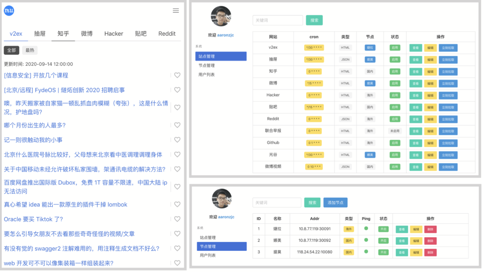

## 介绍

`mu`是一个热榜帖子聚合网站。

这个项目的目的是实践自己掌握的新的技术。目前的技术栈

+ Golang, Gin
+ Vue 3.0, PWA
+ k3s
+ dagger

## 预览&架构

<div align="center">
	
    
</div>
<div align="center">
	
</div>

## 构建部署

因为windows原生不支持`make`，项目采用`mage`和`dagger`作为CI/CD工具集。

安装参考`magefile/mage`项目。

```shell
# 查看可用构建
$ mage
# 构建前端页面
$ mage build_frontend
# 构建后端，会同时编译api,commander,agent
$ mage build_backend
# 打包镜像
$ mage build_image
# 部署到k8s，配置格式参考demo.yml
$ mage deploy 
```

### 授权

MIT